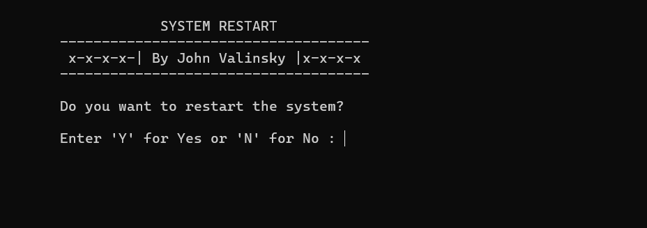

<!-- PROJECT SHIELDS -->




# Windows Restart Utility

A lightweight Windows console application written in C that safely prompts the user to restart the system using a simple Y/N confirmation interface.

Developed as a minimal system-control utility with clean input handling and a user-friendly terminal UI.


# Features

* Simple Y/N confirmation prompt.

* Accepts both uppercase and lowercase input.

* Clears screen for a clean UI.

* Uses native Windows shutdown command.

* Prevents accidental restarts.

* Lightweight and fast.


# Requirements

* Operating System - Windows.

* Compiler - GCC (MinGW), MSVC, or any Windows-compatible C compiler.

* Headers Used: stdio.h, stdlib.h, windows.h, conio.h, ctype.h

# Codes
```bash
#include <stdio.h>
#include <stdlib.h>
#include <windows.h>
#include <conio.h>
#include <ctype.h>

int main(void)
{
    char choice;

    while (1)
    {
        system("cls");

        printf("\n\t            SYSTEM RESTART ");
        printf("\n\t-------------------------------------\n");
        printf("\t x-x-x-x-| By John Valinsky |x-x-x-x");
        printf("\n\t-------------------------------------\n");

        printf("\n\tDo you want to restart the system?");
        printf("\n\n\tEnter 'Y' for Yes or 'N' for No : ");
        scanf(" %c", &choice);

        choice = toupper(choice);   // convert y/n to Y/N

        printf("\n\t-------------------------------------\n");

        if (choice == 'N')
        {
            getch();
            break;
        }
        else if (choice == 'Y')
        {
            printf("\n\tPress ENTER to restart...");
            getch();

            system("shutdown -r -t 0");
            break;
        }
        else
        {
            printf("\n\tInvalid input!");
            printf("\n\tPlease press any key and try again...");
            getch();
        }
    }

    return 0;
}
```
# Compilation
```bash
gcc restart.c -o restart
```


# Using MSVC
```bash
cl restart.c
```


# Usage

1 Run the executable.

2 Choose - Y (Restart System) or N (Exit safely).

3 Any invalid input will re-prompt.


# How it works

* Clears the console using system("cls").

* Converts input to uppercase using toupper().

* Executes
```bash
system("shutdown -r -t 0");
```


# Disclaimer

This program executes a system restart command.
Use responsibly. The author is not responsible for data loss due to unsaved work.


# License

MIT License

Copyright (c) 2026 John Valinsky

Permission is hereby granted, free of charge, to any person obtaining a copy
of this software and associated documentation files, to deal
in the Software without restriction, including without limitation the rights
to use, copy, modify, merge, publish, distribute, sublicense, and/or sell
copies of the Software, and to permit persons to whom the Software is
furnished to do so, subject to the following conditions:

The above copyright notice and this permission notice shall be included in all
copies or substantial portions of the Software.

THE SOFTWARE IS PROVIDED "AS IS", WITHOUT WARRANTY OF ANY KIND, EXPRESS OR
IMPLIED, INCLUDING BUT NOT LIMITED TO THE WARRANTIES OF MERCHANTABILITY,
FITNESS FOR A PARTICULAR PURPOSE AND NONINFRINGEMENT. IN NO EVENT SHALL THE
AUTHORS OR COPYRIGHT HOLDERS BE LIABLE FOR ANY CLAIM, DAMAGES OR OTHER
LIABILITY, WHETHER IN AN ACTION OF CONTRACT, TORT OR OTHERWISE, ARISING FROM,
OUT OF OR IN CONNECTION WITH THE SOFTWARE OR THE USE OR OTHER DEALINGS IN THE
SOFTWARE.