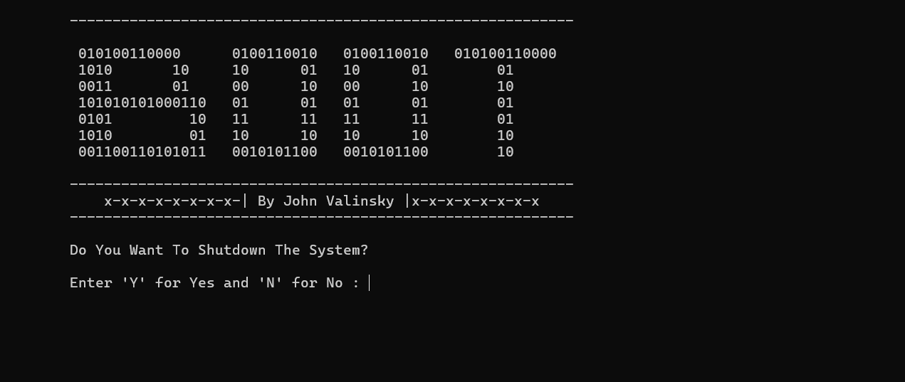

<!-- PROJECT SHIELDS -->




# Windows Shutdown Utility

A simple Windows console application written in C that displays an ASCII banner and asks the user whether to shut down the system.

It accepts both uppercase and lowercase input (Y/y or N/n) and safely initiates a delayed shutdown.


# Features

* ASCII banner display

* User confirmation before shutdown

* Input validation

* 30-second safe shutdown delay

* Windows PATH-based shutdown command


# Requirements

* Windows OS

* GCC/MinGW or MSVC

* Administrator privileges


# Build Instructions

## Using GCC/MinGW
```bash
gcc Shutdown.c Shutdown
```
## Using MSVC
```bash
cl Shutdown.c
```


# Usage

## Run the compiled executable "Shutdown.exe".

* Y or y --> Initiates shutdown (30-second delay).

* N or n --> Cancels and exits.

# Codes
```bash
#include <stdio.h>
#include <stdlib.h>
#include <conio.h>   // for getch() on Windows

int main(void)
{
    char x = 0;

    printf("\n\t-----------------------------------------------------------\n\n");

    printf("\t 010100110000      0100110010   0100110010   010100110000\n");
    printf("\t 1010       10     10      01   10      01        01\n");
    printf("\t 0011       01     00      10   00      10        10\n");
    printf("\t 101010101000110   01      01   01      01        01\n");
    printf("\t 0101         10   11      11   11      11        01\n");
    printf("\t 1010         01   10      10   10      10        10\n");
    printf("\t 001100110101011   0010101100   0010101100        10\n");

    printf("\n\t-----------------------------------------------------------\n");
    printf("\t    x-x-x-x-x-x-x-x-| By John Valinsky |x-x-x-x-x-x-x-x\n");
    printf("\t-----------------------------------------------------------\n");

    /* Ask until valid input */
    while (1) {
        printf("\n\tDo You Want To Shutdown The System?\n");
        printf("\n\tEnter 'Y' for Yes and 'N' for No : ");
        scanf(" %c", &x);

        if (x == 'Y' || x == 'y') {
            printf("\n\tTHANK YOU!\n");
            printf("\tThe System Shutdown is Ready\n");
    printf("\t-----------------------------------------------------------\n");
            printf("\tPress ENTER to Shutdown...");
            getch();

            /* Use PATH instead of hard-coded directory */
            system("shutdown -s -t 30");   // 30s delay for safety
            break;
        }
        else if (x == 'N' || x == 'n') {
            printf("\n\tNo System Shutdown!\n\n\t");
            getch();
            break;
        }
        else {
            printf("\n\tInvalid input! Please enter Y or N.\n");
        }
    }

    return 0;
}
```


### License

MIT License

Copyright (c) 2026 John Valinsky

Permission is hereby granted, free of charge, to any person obtaining a copy
of this software and associated documentation files, to deal
in the Software without restriction, including without limitation the rights
to use, copy, modify, merge, publish, distribute, sublicense, and/or sell
copies of the Software, and to permit persons to whom the Software is
furnished to do so, subject to the following conditions:

The above copyright notice and this permission notice shall be included in all
copies or substantial portions of the Software.

THE SOFTWARE IS PROVIDED "AS IS", WITHOUT WARRANTY OF ANY KIND, EXPRESS OR
IMPLIED, INCLUDING BUT NOT LIMITED TO THE WARRANTIES OF MERCHANTABILITY,
FITNESS FOR A PARTICULAR PURPOSE AND NONINFRINGEMENT. IN NO EVENT SHALL THE
AUTHORS OR COPYRIGHT HOLDERS BE LIABLE FOR ANY CLAIM, DAMAGES OR OTHER
LIABILITY, WHETHER IN AN ACTION OF CONTRACT, TORT OR OTHERWISE, ARISING FROM,
OUT OF OR IN CONNECTION WITH THE SOFTWARE OR THE USE OR OTHER DEALINGS IN THE
SOFTWARE.
